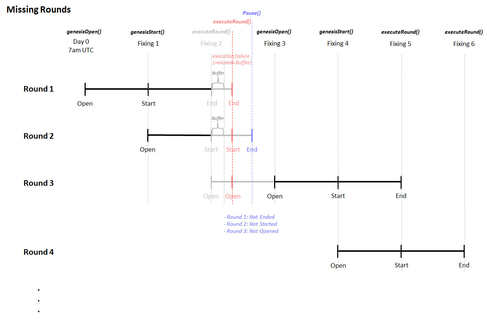

# SuperVol:On Chain Short-term Vol market

## Description

Digital option market for crypto trade on 1 day price change

## Documentation

## Oracle Price Feed (Pyth)

### BTC/USD

- Sonieum: `0x0000000000000000000000000000000000000000000000000000000000000000`
- Sonieum Minato: `0xe62df6c8b4a85fe1a67db44dc12de5db330f7ac66b72dc658afedf0f4a415b43`

### ETH/USD

- Sonieum: `0x0000000000000000000000000000000000000000000000000000000000000000`
- Sonieum Minato: `0xff61491a931112ddf1bd8147cd1b641375f79f5825126d665480874634fd0ace`

### ASTR/USD

- Sonieum: `0x0000000000000000000000000000000000000000000000000000000000000000`
- Sonieum Minato: `0x89b814de1eb2afd3d3b498d296fca3a873e644bafb587e84d181a01edd682853`

## Deployment

### Operation

When a round is started, the round's `lockBlock` and `closeBlock` would be set.

`lockBlock` = current block + `intervalBlocks`

`closeBlock` = current block + (`intervalBlocks` \* 2)

## Kick-start Rounds

The rounds are always kick-started with:

```
genesisOpenRound()
(wait for x blocks)
genesisStartRound()
(wait for x blocks)
executeRound()
```

## Continue Running Rounds

```
executeRound()
(wait for x blocks)
executeRound()
(wait for x blocks)
```

## Resuming Rounds

After errors like missing `executeRound()` etc.

```
pause()
(Users can't participant, but still is able to withdraw)
unpause()
genesisOpenRound()
(wait for x blocks)
genesisStartRound()
(wait for x blocks)
executeRound()
```

## Common Errors

Refer to `test/SuperVol.test.ts`

## Architecture Illustration

### Normal Operation


### Missing Round Operation


